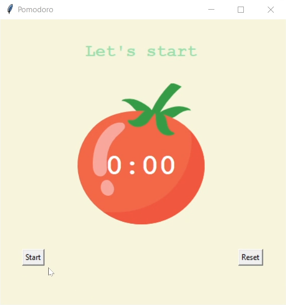
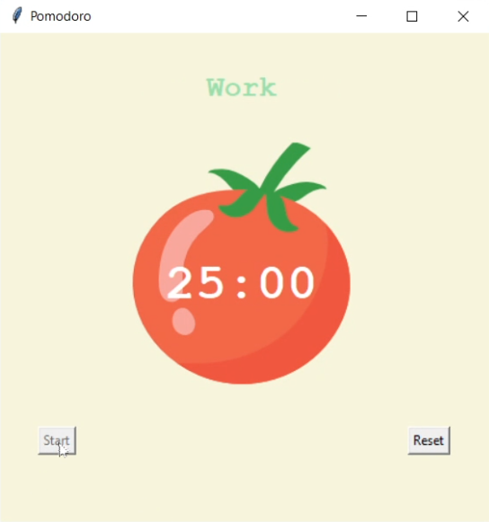
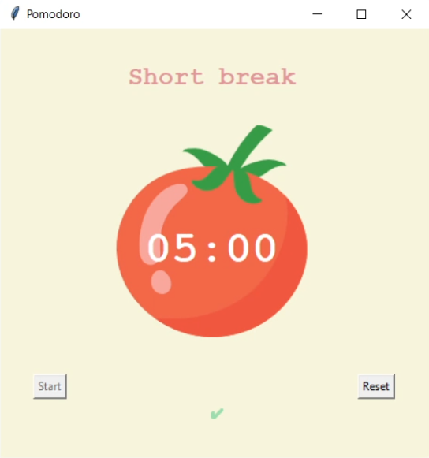

# Pomodoro Timer
This is a simple Pomodoro Timer application programmed in Python and implemented through the Tkinter library.

## What is a Pomodoro?
The Pomodoro Technique is a time management method developed by Francesco Cirillo in the late 1980s. It uses a timer to break work into intervals, traditionally 25 minutes in length, separated by short breaks. Each interval is known as a pomodoro, from the Italian word for 'tomato', after the tomato-shaped kitchen timer that Cirillo used as a university student.

## How Does It Work?
1. **Work Interval**: Set the timer for a 25-minute work session.
2. **Short Break**: After the work session, take a 5-minute break.
3. **Repeat**: Repeat the work and short break intervals three more times.
4. **Long Break**: After completing four work sessions, take a longer 20-minute break to recharge.


## Features
- **Start and Reset Buttons**: Easily start or reset the Pomodoro timer with dedicated buttons.
<p align="center">
  
</p>

- **Pomodoro Timer**: Set a timer for 25 minutes of focused work. 
<p align="center">
  
</p>

- **Break Timer**: Take short 5-minute breaks between work intervals. For every completed cycle, a new ✔ appears to help you track your progress.
<p align="center">
  
</p>

- **Long Break Timer**: After 4 work sessions, take a longer 20-minute break to recharge.
<p align="center">
  
</p>


## Usage
This project requires Python to be installed on your machine. To start the application, run the `main.py` script:

```bash
python main.py
```

Note that the `tkinter` library, which is used in this project, comes natively with Python, so there is no need to install it separately.

## Contributing
This project is open-source so feel free to fork this project and submit pull requests for improvements or new features. Suggestions or enhancements are always welcome!
